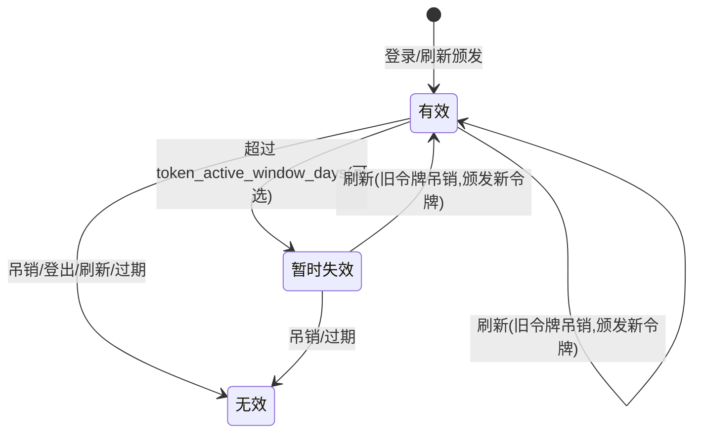
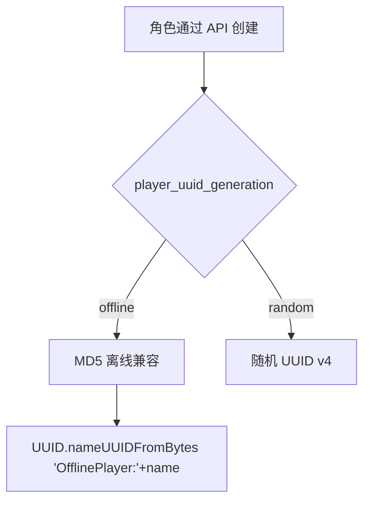
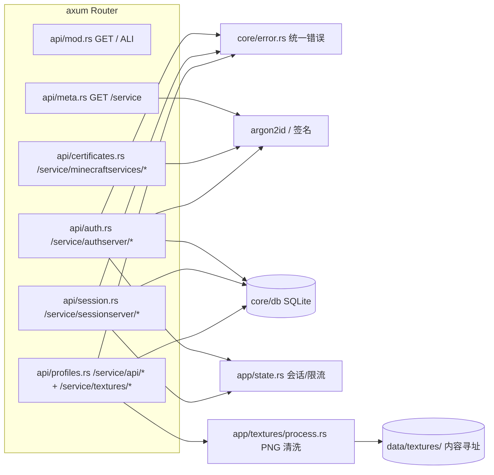
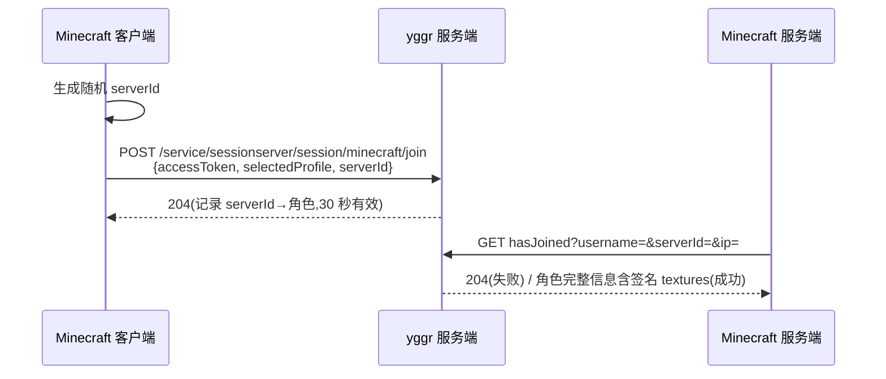
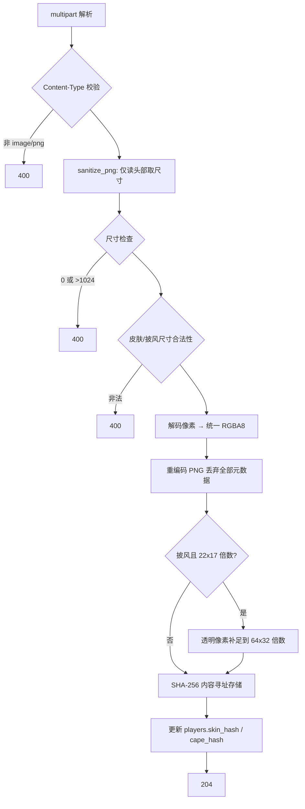
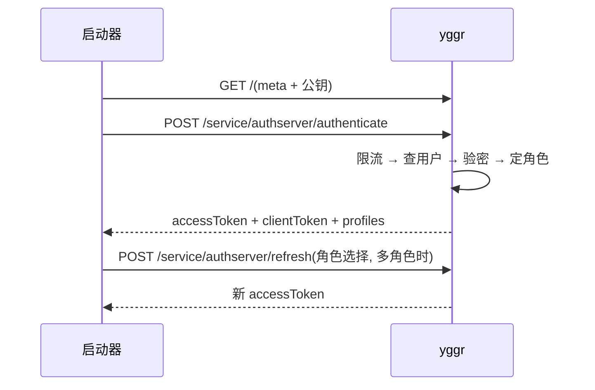
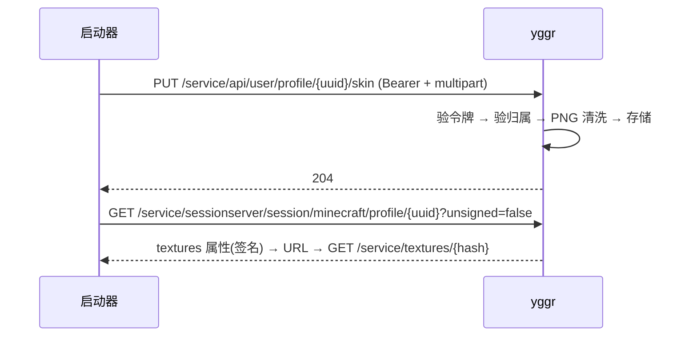

# yggr 服务端架构文档

> 本文档完整描述 yggr 作为 [authlib-injector](https://yushijinhun.github.io/authlib-injector/zh/Home.html) 兼容 Yggdrasil 认证服务端的架构设计、API 实现与安全模型。
> 规范来源:[《Yggdrasil 服务端技术规范》](https://yushijinhun.github.io/authlib-injector/zh/Yggdrasil-%E6%9C%8D%E5%8A%A1%E7%AB%AF%E6%8A%80%E6%9C%AF%E8%A7%84%E8%8C%83.html)与[《签名密钥对》](https://yushijinhun.github.io/authlib-injector/zh/%E7%AD%BE%E5%90%8D%E5%AF%86%E9%92%A5%E5%AF%B9.html)。
> 逐条符合性核对见 [`spec-compliance.md`](spec-compliance.md)。

---

## 1. 概述

yggr 是一个用 Rust 编写的轻量级 Yggdrasil 认证服务端,目标为自用/小规模部署场景设计,兼容 authlib-injector 规范。

**技术栈**:Rust 2024 + axum 0.8 + SQLite(sqlx)+ tokio。单二进制、零外部运行时依赖。

**核心特性**:

| 特性      | 说明                                                                                               |
| --------- | -------------------------------------------------------------------------------------------------- |
| 认证 API  | `authenticate` / `refresh` / `validate` / `invalidate` / `signout`,支持邮箱与角色名登录            |
| 会话 API  | `join` / `hasJoined`,内存会话、30 秒过期、一次性防重放                                             |
| 角色 API  | `profile/{uuid}`(SHA1withRSA 签名 `textures`)、`POST /service/api/profiles/minecraft` 批量查询     |
| 材质系统  | 皮肤/披风上传与清除,PNG 安全校验(防 PNG bomb、去元数据重编码、22x17 披风补足),SHA-256 内容寻址存储 |
| 元数据    | `GET /service` 返回 meta + skinDomains + signaturePublickey,含 ALI 头;根路径 `/` 返回 ALI 头       |
| 消息签名  | `POST /service/minecraftservices/player/certificates`(Minecraft 1.19+,V1/V2 签名)                  |
| 角色 UUID | 离线兼容 `MD5("OfflinePlayer:"+name)` 或随机 v4                               |
| 安全      | 登录限流、argon2id 密码哈希、RSA-4096 自动生成密钥、可选暂时失效令牌                               |

---

## 2. 协议基础约定

以下约定全部遵循 authlib-injector 规范。

### 2.1 通用约定

- **字符编码**:一律 UTF-8。
- **请求/响应格式**:JSON(有 body 时),`Content-Type: application/json; charset=utf-8`,由统一响应包装 `JsonResponse`(`src/core/types.rs`)保证,错误与成功响应一致。
- **HTTPS**:规范要求所有 API 使用 HTTPS。yggr 自身为 HTTP,生产环境必须置于 HTTPS 反向代理之后(见 §6.5)。
- **错误格式**:所有业务错误统一为:

```json
{
  "error": "机器可读的简要描述",
  "errorMessage": "人类可读的详细信息",
  "cause": "错误原因(可选,一般不包含)"
}
```

### 2.2 数据格式

- **无符号 UUID**:去掉所有 `-` 的 32 位十六进制字符串,全项目统一使用。

### 2.3 模型

#### 用户(User)

| 属性              | 说明                             |
| ----------------- | -------------------------------- |
| ID                | 无符号 UUID,主键                 |
| 邮箱(username)    | 全局唯一,登录凭证                |
| 密码              | argon2id PHC 哈希,绝不明文存储   |
| preferredLanguage | 可选,序列化为用户属性,如 `zh_CN` |

用户信息序列化(`requestUser: true` 时出现在响应中):

```json
{
  "id": "无符号 UUID",
  "properties": [{ "name": "preferredLanguage", "value": "zh_CN" }]
}
```

#### 角色(Profile)

| 属性      | 说明                               |
| --------- | ---------------------------------- |
| UUID      | 全局唯一。生成策略见 §2.4          |
| 名称      | 全局唯一、可变;仅作展示,不作为标识 |
| 皮肤/披风 | SHA-256 hash 引用材质文件,可为空   |
| 材质模型  | `classic`(default)或 `slim`        |

角色信息序列化(`properties` 仅在特定 API 中返回):

```json
{
  "id": "无符号 UUID",
  "name": "角色名",
  "properties": [
    { "name": "textures", "value": "Base64", "signature": "Base64(可选)" }
  ]
}
```

- `textures` 属性值 = Base64(JSON),JSON 结构含 `timestamp`(Java 毫秒时间戳)、`profileId`、`profileName`、`textures`(SKIN/CAPE → url + 可选 metadata.model)。
- `signature` = 属性值的 SHA1withRSA(PKCS#1 v1.5)签名,Base64 编码。
- **`uploadableTextures` 属性**:yggr 支持皮肤与披风上传,含 `properties` 的角色响应(hasJoined、profile 查询)中输出 `uploadableTextures: "skin,cape"`,指示客户端可上传的材质类型。

#### 令牌(Token)

| 属性          | 说明                                         |
| ------------- | -------------------------------------------- |
| accessToken   | 服务端随机生成(32 字节随机数 hex),主键       |
| clientToken   | 客户端提供,可为任意字符串,无唯一性要求       |
| 绑定角色      | 可空(空 = 待客户端选择角色)                  |
| 颁发/过期时间 | Unix 毫秒;默认有效期 15 天(`token_ttl_days`) |

令牌状态机(按规范):



- 状态不可逆;刷新只颁发新令牌,不能复活旧令牌。
- **暂时失效状态**:通过 `token_active_window_days` 配置(默认 = `token_ttl_days`,即不启用)。小于 `token_ttl_days` 时启用:令牌颁发后超过 active window 但未过期为暂时失效,仅可刷新;`validate`/`join`/`bearer_token` 拒绝暂时失效令牌。
- **令牌数量上限**:每用户最多 10 个(`api/auth.rs::MAX_TOKENS_PER_USER`),颁发后超限自动按颁发时间吊销最旧的;过期令牌由启动时与后台任务(每 60 秒)定期清理。

### 2.4 角色 UUID 生成



- **离线兼容**(默认):`MD5("OfflinePlayer:" + name)` 摘要后按 Java `UUID.nameUUIDFromBytes` 规则设置 version=3、IETF variant,输出无符号字符串。可无缝迁移离线服存档。
- **随机**:UUID v4。

---

## 3. 模块结构

按依赖方向分层:**api**(HTTP 处理器)→ **app**(应用服务)→ **core**(基础设施),各层 `mod.rs` 聚合导出。

```
src/
├── main.rs              服务入口:配置 → 数据库 → 密钥 → 用户初始化 → HTTP 服务 + join 会话定期清理;Ctrl+C/SIGTERM 优雅退出
├── lib.rs               模块声明与分层 re-export(兼容旧路径);build_app 在 api 层
├── core/                基础设施层(无 HTTP 处理器,不依赖业务)
│   ├── mod.rs           聚合导出(config/crypto/db/error/types)
│   ├── config.rs        配置解析(TOML 分区结构)与默认值;环境变量覆盖;材质域名白名单推导
│   ├── crypto.rs        RSA 密钥生成与加载、SHA1withRSA 签名、argon2id、离线 UUID、随机令牌
│   ├── error.rs         ApiError(统一错误格式)-> IntoResponse
│   ├── types.rs         公共序列化类型(JsonResponse / Property / ProfileResponse / UserResponse)
│   └── db/              SQLite 数据层
│       ├── mod.rs       聚合导出(models/queries)
│       ├── models.rs    User / Player / Token / TextureKind 数据模型
│       └── queries.rs   Schema、初始化、用户/角色/令牌 CRUD
├── app/                 应用服务层(共享状态、材质系统、用户初始化)
│   ├── mod.rs           聚合导出(user/state/textures)
│   ├── state.rs         共享状态:AppState(池/密钥/会话缓存/限流器)、JoinRecord、RateLimiter
│   ├── user.rs          用户初始化(user.toml 创建允许登录的用户)
│   └── textures/        材质系统
│       ├── mod.rs       聚合导出(store/process/payload/defaults)
│       ├── store.rs     内容寻址存储 data/textures/{sha256}.png
│       ├── process.rs   PNG 安全校验(sanitize/pad)
│       ├── payload.rs   textures 属性构造与签名
│       └── defaults.rs  内置默认皮肤(steve/alex),无皮肤时回退
└── api/                 HTTP 处理器层(全部规范路径挂载于 /service 下)
    ├── mod.rs           build_app 路由组装 + 根路径 ALI + 聚合导出
    ├── auth.rs          /service/authserver/* 五个认证端点 + Bearer 令牌解析 + TokenStatus
    ├── session.rs       /service/sessionserver/*:join / hasJoined / profile 查询
    ├── profiles.rs      /service/api/profiles/minecraft 批量查询 + 材质上传/清除 + 材质文件 + 旧式皮肤 API
    ├── certificates.rs  /service/minecraftservices/player/certificates(1.19+ 消息签名密钥)
    └── meta.rs          GET /service 元数据 + ALI 头
```



---

## 4. 数据模型(SQLite)

```sql
users (
  id                TEXT PRIMARY KEY,          -- 无符号 UUID
  username          TEXT NOT NULL UNIQUE,      -- 邮箱
  password_hash     TEXT NOT NULL,             -- argon2id PHC
  preferred_language TEXT NOT NULL DEFAULT 'zh_CN'
)

players (
  id          TEXT PRIMARY KEY,                -- 无符号 UUID
  name        TEXT NOT NULL UNIQUE,            -- 角色名(全局唯一)
  user_id     TEXT NOT NULL REFERENCES users(id) ON DELETE CASCADE,
  skin_hash   TEXT,                            -- SHA-256,引用 data/textures/{hash}.png
  cape_hash   TEXT,
  skin_model  TEXT NOT NULL DEFAULT 'classic'  -- CHECK (classic|slim)
)

tokens (
  access_token TEXT PRIMARY KEY,               -- 随机 hex
  client_token TEXT NOT NULL,                  -- 客户端提供
  user_id      TEXT NOT NULL REFERENCES users(id) ON DELETE CASCADE,
  player_id    TEXT REFERENCES players(id) ON DELETE CASCADE,  -- 可空
  issued_at    INTEGER NOT NULL,               -- Unix 毫秒
  expires_at   INTEGER NOT NULL
)
-- 索引:players(user_id)、tokens(user_id)、tokens(player_id)
```

数据文件布局(`data_dir`,默认 `data/`,可通过环境变量 `YGGR_DATA_DIR` 覆盖):

```
data/
├── yggr.db           SQLite 数据库
├── private_key.pem   签名私钥(PKCS#8 PEM,首次启动自动生成,勿泄露/勿更换)
└── textures/         材质内容寻址存储 {sha256}.png
```

配置文件布局(`config_dir`,默认 `config/`,可通过环境变量 `YGGR_CONFIG_DIR` 覆盖):

```
config/
├── config.toml       主配置文件
└── user.toml         用户配置(可选)
```

---

## 5. API 端点全景

> 所有 Yggdrasil 规范端点挂载在 `/service` 下。根路径 `/` 返回 ALI 头(指向 `/service`),留给管理 API 与前端。
> `{uuid}`、`{hash}` 均为无符号 UUID / hex 字符串。
> 错误响应格式统一见 §2.1。

| 方法   | 路径                                                              | 模块             | 认证   | 说明                                               |
| ------ | ----------------------------------------------------------------- | ---------------- | ------ | -------------------------------------------------- |
| GET    | `/`                                                               | api/mod          | 无     | 空 200 + ALI 头(指向 `/service`)                   |
| GET    | `/service`                                                        | api/meta         | 无     | 元数据 + skinDomains + signaturePublickey + ALI 头 |
| POST   | `/service/authserver/authenticate`                                | api/auth         | 无     | 登录                                               |
| POST   | `/service/authserver/refresh`                                     | api/auth         | 无     | 刷新令牌(原令牌吊销)                               |
| POST   | `/service/authserver/validate`                                    | api/auth         | 无     | 验证令牌(有效 -> 204)                              |
| POST   | `/service/authserver/invalidate`                                  | api/auth         | 无     | 吊销令牌(恒 204)                                   |
| POST   | `/service/authserver/signout`                                     | api/auth         | 无     | 登出,吊销该用户全部令牌(204)                       |
| POST   | `/service/sessionserver/session/minecraft/join`                   | api/session      | 无     | 客户端进服登记(204)                                |
| GET    | `/service/sessionserver/session/minecraft/hasJoined`              | api/session      | 无     | 服务端验客户端(失败 -> 204)                        |
| GET    | `/service/service/sessionserver/session/minecraft/profile/{uuid}` | api/session      | 无     | 角色属性查询(`unsigned` 参数)                      |
| POST   | `/service/api/profiles/minecraft`                                 | api/profiles     | 无     | 按名称批量查询(≤100)                               |
| PUT    | `/service/api/user/profile/{uuid}/skin`                           | api/profiles     | Bearer | 上传皮肤                                           |
| DELETE | `/service/api/user/profile/{uuid}/skin`                           | api/profiles     | Bearer | 清除皮肤                                           |
| PUT    | `/service/api/user/profile/{uuid}/cape`                           | api/profiles     | Bearer | 上传披风                                           |
| DELETE | `/service/api/user/profile/{uuid}/cape`                           | api/profiles     | Bearer | 清除披风                                           |
| GET    | `/service/textures/{hash}`                                        | api/profiles     | 无     | 材质文件(`image/png`)                              |
| GET    | `/service/textures/default/{model}`                              | api/profiles     | 无     | 内置默认皮肤(`classic`/`slim`)                      |
| GET    | `/service/skins/MinecraftSkins/{username}`                        | api/profiles     | 无     | 旧式皮肤 API(`legacy_skin_api=true` 时生效)        |
| POST   | `/service/minecraftservices/player/certificates`                  | api/certificates | Bearer | 1.19+ 消息签名密钥对                               |

### 5.1 元数据 - `GET /`

响应(含 `X-Authlib-Injector-API-Location: /service` 头):

```json
{
  "meta": {
    "serverName": "My Yggdrasil",
    "implementationName": "yggr",
    "implementationVersion": "0.1.0",
    "links": { "homepage": "https://ygg.example.com" },
    "feature.non_email_login": true,
    "feature.enable_profile_key": true
  },
  "skinDomains": [".ygg.example.com"],
  "signaturePublickey": "-----BEGIN PUBLIC KEY-----\n...\n-----END PUBLIC KEY-----\n"
}
```

要点:

- `signaturePublickey` 为 PEM 公钥,以 `-----BEGIN PUBLIC KEY-----` 开头、`-----END PUBLIC KEY-----` 结尾,允许内部换行与文末换行,不允许其他空白字符。
- `skinDomains`:默认从 `base_url` 推导 `.` 前缀规则(匹配子域),可经 `skin_domains` 配置追加;规则以 `.` 开头匹配子域,否则精确匹配。Minecraft 仅从白名单域名下载材质,否则报 `Textures payload has been tampered with (non-whitelisted domain)`。
- 高级 feature 选项(`legacy_skin_api`、`no_mojang_namespace`、`enable_mojang_anti_features`、`username_check`)均未设置,保持规范默认值,与 authlib-injector 客户端默认行为兼容。

### 5.2 认证 API

#### POST `/service/authserver/authenticate`

请求:

```json
{
  "username": "邮箱或角色名",
  "password": "密码",
  "clientToken": "可选,缺省时服务端生成随机 UUID",
  "requestUser": true,
  "agent": { "name": "Minecraft", "version": 1 }
}
```

流程:限流检查 → 用户查找(先邮箱;`non_email_login` 时回退角色名)→ argon2id 验密 → 确定绑定角色 → 生成令牌落库。

角色绑定规则(规范):无角色 → 空;仅一个角色 → 自动绑定;多角色 → 空(由客户端选择);**角色名登录 → 直接绑定该角色**(绕过角色选择)。

响应:

```json
{
  "accessToken": "…",
  "clientToken": "…",
  "availableProfiles": [{ "id": "…", "name": "…" }],
  "selectedProfile": { "id": "…", "name": "…" },
  "user": {
    "id": "…",
    "properties": [{ "name": "preferredLanguage", "value": "zh_CN" }]
  }
}
```

错误:密码错误/限流 → `403 ForbiddenOperationException / Invalid credentials. Invalid username or password.`

#### POST `/service/authserver/refresh`

请求:

```json
{
  "accessToken": "…",
  "clientToken": "可选(提供则校验)",
  "requestUser": false,
  "selectedProfile": { "id": "…" }
}
```

流程:校验令牌(含可选 clientToken)→ 若含 `selectedProfile` 则执行角色选择(要求原令牌未绑定角色且角色属于该用户)→ 吊销原令牌 → 颁发新令牌(clientToken 与原令牌相同)→ 响应 `accessToken` / `clientToken` / `selectedProfile` / 可选 `user`。

错误:

- 令牌无效 → `403 ForbiddenOperationException / Invalid token.`
- 令牌已绑定角色仍指定角色 → `400 IllegalArgumentException / Access token already has a profile assigned.`
- 选择不属于自己的角色 → `400 IllegalArgumentException / Profile is not owned by the user.`(规范中此项为非标准未定义项,400 可接受)

刷新过程:先颁发新令牌,成功后再吊销原令牌(失败时原令牌保持有效);随后执行令牌数量上限清理。

#### POST `/service/authserver/validate`

请求 `{ "accessToken", "clientToken"(可选,提供则校验) }`。有效 → `204 No Content`;无效 → 403(如上)。

#### POST `/service/authserver/invalidate`

请求同上。只检查 `accessToken`,忽略 clientToken 值;**无论成功与否恒返回 204**。

#### POST `/service/authserver/signout`

请求 `{ "username", "password" }`。验密通过后吊销该用户全部令牌 → 204。受与 authenticate 相同的限流保护(防密码探测)。

### 5.3 会话 API(进服验证)

进服流程(规范):



#### POST `/service/sessionserver/session/minecraft/join`

请求 `{ "accessToken", "selectedProfile", "serverId" }`。

校验:令牌有效且未过期,且 `selectedProfile` == 令牌绑定角色 UUID。成功 → 内存写入 `serverId → JoinRecord{player_id, player_name, ip, expires_at=now+30s}` → 204。失败 → `403 ForbiddenOperationException / Invalid token.`(与规范错误表一致:"试图使用一个错误的角色加入服务器")。

- 会话存于内存 `HashMap`(`state.sessions`),30 秒过期,后台任务每 60 秒清理。
- `serverId` 随机性强,作为主键;记录包含客户端 IP 供 hasJoined 校验。

#### GET `/service/sessionserver/session/minecraft/hasJoined?username=&serverId=&ip=`

校验顺序:记录存在 → 未过期 → `username` 与记录角色名一致 → (`check_ip=true` 且请求含 `ip` 时)IP 一致。

- **一次性消费**:无论成功失败即删除记录,防重放。
- 成功 → 200,返回角色完整信息(**含签名 textures 属性**);失败 → `204 No Content`。

#### GET `/service/sessionserver/session/minecraft/profile/{uuid}?unsigned=`

- `unsigned` 默认 `true`:响应不含签名;`unsigned=false` 时 `textures` 属性附带 `signature`。
- 角色不存在 → 204。
- 仅当角色有皮肤/披风时才输出 `properties`。

### 5.4 角色 API

#### POST `/service/api/profiles/minecraft`

请求 `["角色名", ...]`(≤100,空数组返回空)。响应为命中角色数组,**不含 properties**、次序无要求、不存在的角色跳过。超限 → `400 IllegalArgumentException`。

### 5.5 材质上传/清除

```
PUT    /service/api/user/profile/{uuid}/skin
DELETE /service/api/user/profile/{uuid}/skin
PUT    /service/api/user/profile/{uuid}/cape
DELETE /service/api/user/profile/{uuid}/cape
```

认证:`Authorization: Bearer {accessToken}`;缺失或无效 → `401`。角色不存在或不属于令牌用户 → `404 Unknown profile`。成功 → `204`。

**PUT** 载荷 `multipart/form-data`:

| 字段    | 说明                                            |
| ------- | ----------------------------------------------- |
| `model` | 仅皮肤:`slim` 或空/`classic`(普通);非法值 → 400 |
| `file`  | PNG 图像,Content-Type 须为 `image/png`          |

上传处理管线:



**DELETE**:清除对应材质(hash 置空),恢复默认 → 204。

尺寸合法性(规范):

| 类型 | 合法尺寸                                                      |
| ---- | ------------------------------------------------------------- |
| 皮肤 | 64x32 的整数倍 或 64x64 的整数倍(宽高缩放系数一致)            |
| 披风 | 64x32 的整数倍 或 22x17 的整数倍(22x17 必须补足到 64x32 倍数) |

### 5.6 材质文件 — `GET /service/textures/{hash}`

- 内容寻址:文件名即 SHA-256 hash(Minecraft 缓存依赖此约定,hash 由服务端计算)。
- 响应头 `Content-Type: image/png`(必须,防 MIME Sniffing);不存在 → 404。
- 材质 URL 由 `base_url` 拼装:`{base_url}/service/textures/{hash}`,并写入 textures 属性。

### 5.7 消息签名密钥 — `POST /service/minecraftservices/player/certificates`

Minecraft 1.19+ 聊天消息签名(由 `feature.enable_profile_key: true` 开启)。

- 认证:Bearer 令牌;要求**已绑定角色**(未绑定 → 400 `Access token has no profile assigned.`)。
- 每次请求生成新 RSA-2048 会话密钥对(私有,不缓存)。

响应:

```json
{
  "keyPair": {
    "privateKey": "Base64(PKCS#8 DER)",
    "publicKey": "Base64(SPKI DER)",
    "publicKeySignature": "Base64(SHA1withRSA over publicKey DER)",
    "publicKeySignatureV2": "Base64(SHA256withRSA over {expiresAt,keyPair} JSON)"
  },
  "expiresAt": "RFC3339(7 天后)",
  "refreshedAfter": "RFC3339(1 天后)"
}
```

---

## 6. 安全设计

### 6.1 密码安全

- argon2id 默认参数哈希,PHC 格式存储;任何 API 均不回显密码相关数据。
- 登录与登出接口限流(`login_rate_limit_per_minute`,0 禁用),按**客户端 IP** 与**用户名**双维度计数(规范建议针对用户),超限按密码错误返回(不泄露限流状态)。

### 6.2 签名体系

- 签名私钥 RSA-4096(规范推荐长度)首次启动自动生成于 `data/private_key.pem`;certificates 的会话密钥对仍为 RSA-2048(与 Mojang 官方一致)。
- 私钥应长期保持稳定:多实例负载均衡必须共享同一密钥,否则客户端验签失败(meta 中公钥变化会导致 `Textures payload has been tampered with`)。
- 签名算法:SHA1withRSA(PKCS#1 v1.5),与 Java `Signature.getInstance("SHA1withRSA")` 字节级兼容,用于 textures 属性与 certificates V1;V2 用 SHA256withRSA。

### 6.3 材质安全(防远程代码执行/DoS)

规范引用的缺陷:未检查的上传材质可藏匿恶意代码经服务端分发(issue #10)。yggr 对策:

1. **PNG bomb 防护**:解码前仅读取 PNG 头(尺寸),`>1024` 直接拒绝,不分配像素缓冲。
2. **尺寸合法性**:皮肤/披风尺寸规则见 §5.5。
3. **元数据剥离**:解码 → RGBA8 → 完整重编码,丢弃 tEXt/iTXt/tRNS 等一切非位图数据。
4. 22x17 非标准披风以透明像素补足。

### 6.4 会话安全

- join 记录 30 秒过期(内存),hasJoined 一次性消费防重放。
- 可选 IP 校验(`check_ip`):需反向代理正确传递 `X-Forwarded-For`(yggr 取首个值)。
- 令牌 32 字节随机 hex(256-bit),过期默认 15 天。

### 6.5 部署安全

- **必须 HTTPS**:生产环境置于反向代理(Nginx/Caddy)之后,`base_url` 填 HTTPS 域名,代理透传 `X-Forwarded-For`。
- `config/user.toml` 含明文密码,勿提交版本库。
- 密钥文件 `private_key.pem` 权限收紧,丢失即所有已签名属性失效。

---

## 7. 关键流程速览

### 7.1 登录



### 7.2 材质上传



---

## 8. 配置参考

配置文件采用分区结构(TOML sections),见 `config/config.example.toml`:

| 配置项                              | 默认                    | 说明                               |
| ----------------------------------- | ----------------------- | ---------------------------------- |
| `[server]`                          |                         | 服务器基本配置                      |
| `name`                              | `My Yggdrasil`          | meta.serverName                    |
| `base_url`                          | `http://127.0.0.1:8080` | 材质 URL 基准 + skinDomains 推导   |
| `listen`                            | `0.0.0.0:8080`          | 监听地址                           |
| `skin_domains`                      | `[]`                    | 追加白名单规则                     |
| `[data]`                            |                         | 数据目录                           |
| `dir`                               | `data`                  | 数据库/密钥/材质目录(YGGR_DATA_DIR 覆盖) |
| `[auth]`                            |                         | 认证配置                           |
| `player_uuid_generation`            | `offline`               | `offline`/`random`                 |
| `token_ttl_days`                    | `15`                    | 令牌有效期                         |
| `token_active_window_days`          | `15`                    | 令牌有效窗口;小于 ttl 启用暂时失效 |
| `non_email_login`                   | `true`                  | 角色名登录 + meta feature          |
| `login_rate_limit_per_minute`       | `10`                    | 每 IP 限流,0 禁用                  |
| `check_ip`                          | `false`                 | hasJoined IP 校验                  |
| `max_players_per_user`              | `5`                     | 每用户角色数量上限                  |
| `[user]`                            |                         | 用户配置                           |
| `file`                              | `user.toml`             | 用户配置,相对配置目录;`None` 禁用  |
| `[meta]`                            |                         | 实现信息                           |
| `implementation_name`               | `yggr`                  | meta.implementationName            |
| `implementation_version`            | 包版本                  | meta.implementationVersion         |
| `register_url`                      | `None`                  | 注册页面地址(meta.links.register)  |
| `[features]`                        |                         | 高级功能选项                       |
| `legacy_skin_api`                   | `false`                 | 旧式皮肤 API 服务端处理            |
| `no_mojang_namespace`               | `false`                 | 禁用 @mojang 命名空间              |
| `enable_mojang_anti_features`       | `false`                 | 开启 Minecraft anti-features       |
| `username_check`                    | `false`                 | 启用用户名验证                     |
| `[frontend]`                        |                         | 前端配置                           |
| `dir`                               | `frontend/dist`         | 前端目录(YGGR_FRONTEND_DIR 覆盖)   |

环境变量覆盖:

| 环境变量           | 默认             | 说明                       |
| ------------------ | ---------------- | -------------------------- |
| `YGGR_CONFIG_DIR`  | `config`         | 配置目录                   |
| `YGGR_DATA_DIR`    | `[data] dir`     | 数据目录                   |
| `YGGR_FRONTEND_DIR`| `[frontend] dir` | 前端目录                   |

---

## 9. 规范符合性总览

| 规范章节                              | 状态                 |
| ------------------------------------- | -------------------- |
| 基本约定(编码/JSON/错误格式/数据格式) | 符合                 |
| 模型:用户/角色/令牌                   | 符合(含暂时失效状态) |
| 认证 API(5 端点)                      | 符合                 |
| 会话 API(join/hasJoined/profile)      | 符合                 |
| 角色 API(批量查询)                    | 符合                 |
| 材质上传(含 PNG 安全)                 | 符合                 |
| 元数据 + ALI                          | 符合                 |
| 签名密钥对                            | 符合(RSA-4096)       |
| certificates(profile key 扩展)        | 符合                 |
| 可选 feature 选项                     | 符合(全部可配置)     |

全部规范项已符合,逐条核对见 [`spec-compliance.md`](spec-compliance.md)。
